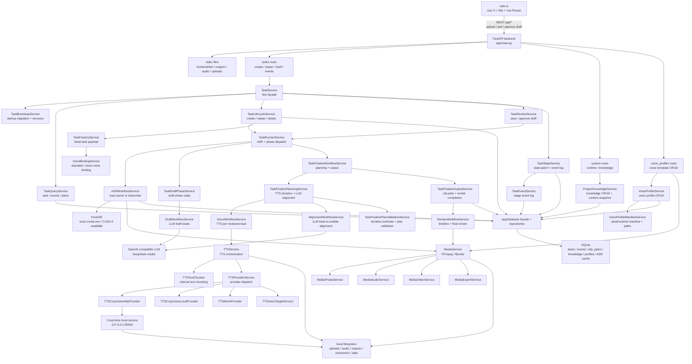
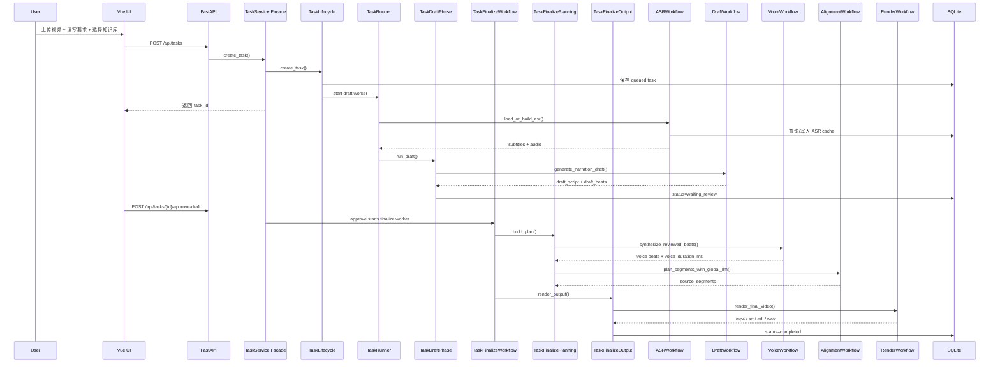
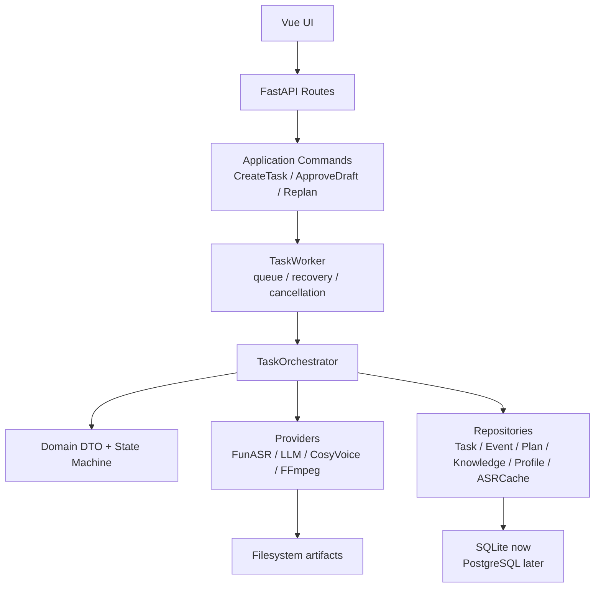

# Clip MVP 项目架构

## 1. 项目定位

Clip MVP 是一个“字幕驱动的 AI 视频解说剪辑系统”。它不是传统时间线编辑器，核心目标是把一条长视频自动处理成带 AI 文案、AI 配音和粗剪画面的成片。

核心主链路：

```text
raw_video -> FunASR subtitles -> LLM draft beats -> user review
          -> TTS voice durations -> LLM segment alignment -> FFmpeg render
```

关键原则：

- 用户确认后的文案结构不能被后端静默改写。
- LLM 负责语义判断，本地规则只能做合法化、校验和工程兜底。
- 知识库只放长期实体、别名、术语；单次视频事实放“本次补充事实”。
- 配音时长是最终选片的重要约束，最终视频不能截断配音。

## 2. 总体架构



这个架构里，`TaskService` 已经降级为 API facade，不再直接编排 ASR、写稿、配音、选片、渲染。任务生命周期、查询、草稿确认、运行编排、状态写入和最终输出分别拆到了独立服务。

## 3. 前端结构

```text
frontend/
  src/
    App.vue                  # 顶部导航 + RouterView
    router/index.ts          # 页面路由
    stores/clipAppState.ts   # 前端共享状态、任务轮询、草稿确认动作
    api/client.ts            # REST API client
    views/
      DashboardView.vue
      CreateTaskView.vue
      TasksView.vue
      TaskDetailView.vue
      KnowledgeView.vue
      RuntimeView.vue
    components/
      TaskCreateForm.vue
      TaskDetail.vue
      TaskHistory.vue
      KnowledgePanel.vue
      RuntimePanel.vue
```

前端页面职责：

- `/`：项目总览和入口。
- `/create`：创建任务，选择视频、知识库、目标、配音参数。
- `/tasks`：任务列表和删除/清空操作。
- `/tasks/:id`：任务详情、文案确认、事件日志、最终选片、重新生成。
- `/knowledge`：项目知识库管理。
- `/runtime`：ASR、LLM、TTS、后端环境状态。

## 4. 后端目录结构

```text
app/
  main.py                    # FastAPI app、路由注册、静态文件挂载、CosyVoice 预热
  api/
    task_form_normalizer.py  # 任务创建/重生成表单归一化
    voice_profile_presenter.py # 配音模板 API 输出格式化
    routes/
      tasks.py               # 任务创建、草稿保存/确认、重生成、删除、方案
      system.py              # runtime、project knowledge API
      voice_profiles.py      # 配音模板 API
  core/
    config.py                # Settings、路径、模型配置
    db.py                    # AppDatabase facade，委托 repository
  domain/
    schemas.py               # DraftBeat / AlignedSegment 等基础 DTO
  repositories/
    sqlite_database_maintenance.py # schema 初始化、迁移、外部 DB 合并
    sqlite_task_repository.py # tasks / task_events
    sqlite_asr_cache_repository.py
    sqlite_clip_plan_repository.py
    sqlite_project_knowledge_repository.py
    sqlite_voice_profile_repository.py
    row_mappers.py
  services/
    task_service.py          # API facade，委托给各 task_* service
    task_bootstrap_service.py # 启动迁移、恢复中断任务、同步配音模板
    task_query_service.py    # 任务查询、事件查询、历史方案元数据回填
    task_lifecycle_service.py # 创建、重生成、删除任务
    task_review_service.py   # 草稿保存、草稿确认、启动 finalize
    task_runner_service.py   # ASR + draft/finalize phase 分发
    task_state_service.py    # 状态 patch、任务脱敏、事件写入
    task_factory_service.py  # 初始任务 payload 构建
    task_worker_service.py   # 后台线程去重和生命周期
    task_draft_phase_service.py # draft 阶段状态和结果写入
    task_finalize_workflow_service.py # finalize 阶段总编排
    task_finalize_planning_service.py # finalize planning facade，按配音模式分发
    task_finalize_plan_models.py # FinalizePlanningResult / callback 类型
    task_finalize_plan_validation_service.py # 无配音时长估算、选片数量/时长校验
    task_finalize_script_planner.py # 无配音路径：估算时长 + LLM 选片
    task_finalize_voice_planner.py # 配音路径：TTS 真实时长 + LLM 选片
    task_finalize_output_service.py # clip plan 保存 + 渲染 + completed 状态
    asr_workflow_service.py  # 抽音频、ASR 缓存、字幕生成
    draft_workflow_service.py # 初稿 beats 生成
    voice_workflow_service.py # 确认文案后的逐段配音
    alignment_workflow_service.py # LLM beat 对齐编排
    alignment_subtitle_service.py # 字幕标准化、时间窗文本提取
    alignment_duration_service.py # 配音时长拟合、选片过长校验
    render_workflow_service.py # timeline、成片导出
    llm_service.py           # LLM facade，保留兼容入口
    llm_narration_service.py # 文案初稿请求、校验失败后的修复请求
    llm_alignment_service.py # beat + 全量字幕 + 配音时长的 LLM 选片请求
    llm_draft_service.py     # 文案草稿 JSON 解析、grounding 校验、beat 原子性校验
    llm_format_service.py    # LLM format facade，兼容旧 import
    llm_json_format_service.py # LLM JSON 包裹清洗
    llm_subtitle_format_service.py # 字幕归一化、alignment units
    llm_grounding_format_service.py # grounding 字段归一化
    llm_alignment_format_service.py # beat duration guidance、alignment 响应归一化
    llm_prompt_service.py    # 文案、修复、选片 prompt 常量
    tts_service.py           # TTS 编排、分块合成、语速后处理
    tts_provider_service.py  # TTS provider 调度 facade
    tts_provider_config_service.py # provider/mode/speed 配置判断
    tts_voice_target_service.py # 默认音色和 voice profile -> provider voice id
    tts_cosyvoice_http_provider.py # CosyVoice HTTP 合成
    tts_cosyvoice_local_provider.py # CosyVoice 子进程 batch 合成
    tts_mock_provider.py      # mock 静音音频 provider
    tts_text_chunker.py      # TTS 内部分句/分块算法
    cosyvoice_runtime_service.py # CosyVoice 常驻服务管理
    media_service.py         # media facade，兼容旧调用
    media_probe_service.py   # ffprobe 时长、音频流检测
    media_audio_service.py   # 参考音频规范化、旁白轨、音频拼接/补齐
    media_video_service.py   # 视频剪切拼接、旁白混流
    media_export_service.py  # 时间线、字幕 remap、SRT、EDL
    runtime_service.py       # 运行环境状态聚合 + 缓存
    runtime_probe_service.py # 当前/外部 Python 模块探测
    runtime_cosyvoice_status_service.py # CosyVoice provider/service 状态
    task_event_service.py    # 任务阶段事件
    project_knowledge_service.py # 知识库和上下文快照
    voice_binding_service.py # 配音模式和音色模板绑定
    voice_profile_service.py # 配音模板业务 facade
    voice_profile_manifest_service.py # seed/runtime manifest、路径解析
    voice_profile_upload_service.py # 上传参考音频、转码并创建模板
    tts_cache_service.py     # TTS 缓存路径
  tools/
    cosyvoice_local_server.py
    cosyvoice_local_helper.py
```

## 5. 后端主链路



## 6. 数据与存储

```text
data/clip_mvp.db
  tasks
  task_events
  asr_cache
  clip_plans
  project_knowledge
  voice_profiles

uploads/
  uploaded source videos

audio/
  extracted ASR audio

outputs/
  rendered mp4 / srt / edl

outputs/voiceovers/
  generated narration wav files

data/tts_profiles/
  user uploaded reference audio
```

当前仍使用 SQLite，适合本地单机 MVP。后续如果变成多用户或并发队列，再考虑 PostgreSQL + 队列系统。

## 7. 当前已完成的工程化拆分

已经从早期 demo 结构拆出的内容：

- 前端从单 HTML/JS 迁到 `Vue 3 + Vite + Vue Router`。
- `task_service.py` 已降级为 facade，任务创建/查询/review/runner/state/finalize 子阶段已拆出。
- finalize 阶段已拆成 planning 和 output：前者负责 TTS/LLM 选片/时长校验，后者负责 clip plan、渲染和完成状态。
- 知识库从任务编排里拆成 `project_knowledge_service.py`。
- 配音模板绑定从任务编排里拆成 `voice_binding_service.py`。
- 任务事件日志已经落库，前端详情页可展示阶段事件。
- CosyVoice 已变成常驻本地服务，避免每次任务重复加载模型。
- `llm_service.py` 已拆成 facade + narration/alignment/draft/format/prompt 模块，LLM 请求、prompt、解析、校验和格式化职责已分离。
- `app/core/db.py` 已拆成 AppDatabase facade + repositories，schema/迁移、task、event、ASR cache、clip plan、knowledge、voice profile 分表访问已分离。
- API 层已抽出 `task_form_normalizer.py`、`voice_profile_presenter.py` 和 `voice_profile_upload_service.py`，路由文件不再直接承担复杂表单归一化和上传处理。
- `voice_profile_service.py` 已拆出 `voice_profile_manifest_service.py`，配音模板业务与 seed/runtime manifest、路径解析分离。
- `tts_service.py` 已拆出 `tts_text_chunker.py`，长文案内部拆块算法不再混在 provider 调用里。
- `tts_service.py` 已进一步拆出 TTS provider 层，provider 调度、配置判断、voice target、CosyVoice HTTP、本地子进程和 mock 合成分别独立。
- `media_service.py` 已变成兼容 facade，ffprobe、音频处理、视频剪切混流、字幕/EDL 导出分别拆到 `media_probe/audio/video/export` 子服务。
- `alignment_workflow_service.py` 已拆出 `alignment_subtitle_service.py` 和 `alignment_duration_service.py`，LLM 对齐编排与本地合法化/时长校验分离。
- `task_finalize_planning_service.py` 已拆出 `task_finalize_plan_validation_service.py`，无配音估算和最终计划校验不再混在 finalize 编排里。
- `runtime_service.py` 已拆成 runtime 状态聚合、Python 模块探测和 CosyVoice 状态构建，`/runtime` 返回结构保持兼容。
- `task_finalize_planning_service.py` 已进一步拆成 planning facade、script planner、voice planner 和 planning result model，无配音/配音两条路径职责分离。
- `llm_format_service.py` 已拆成 format facade + JSON/subtitle/grounding/alignment 子模块，LLM 格式化职责不再集中在一个文件。

## 8. 当前主要耦合点

还没有完全工程化的地方：

- `app/core/db.py` 仍是单文件数据库访问层，后续应拆 repository。
- workflow 之间仍大量传 dict，DTO 还不够完整。
- API route 仍以 `Form(...)` 参数接收上传任务，虽然已有 normalizer，但还不是正式 request command/schema。
- workflow 之间虽然已经拆服务，但仍大量传 dict，缺少强类型 DTO，后续改动仍容易字段漂移。
- API route 仍以 `Form(...)` 参数接收上传任务，虽然已有 normalizer，但还不是正式 request command/schema。
- `llm_prompt_service.py` 仍是单文件 prompt 常量集合，可以按 narration/alignment/repair 拆分，但优先级低于 DTO 化。

## 9. 目标演进架构



推荐下一步顺序：

1. 建 `domain/models`，固定 `TaskPayload / TaskResult / VoiceBeat / AlignedSegment / ClipPlan`。
2. API route 改用 request/response schema 或 command 对象，减少 Form 参数散落。
3. 按 narration/alignment/repair 拆 `llm_prompt_service.py`，或者直接进入 DTO 化。
4. 再抽统一 Provider 接口，方便替换 ASR/LLM/TTS。
5. 最后补队列/取消/重试策略，替代当前本地线程 worker。
