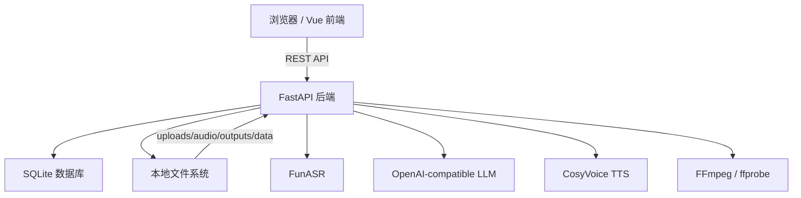
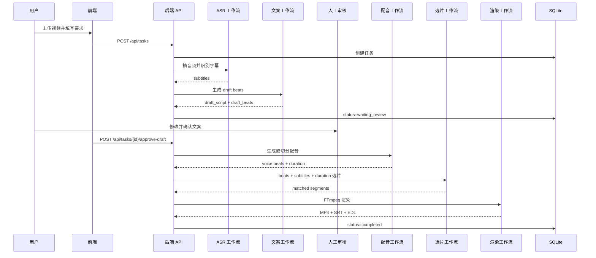

# AI 视频解说剪辑系统系统设计文档

## 1. 引言

### 1.1 编写目的

本文档说明 AI 视频解说剪辑系统的总体设计、模块设计、数据设计、接口设计、核心流程和部署设计。本文档用于指导开发、测试、维护和后续扩展。

### 1.2 设计目标

- 保持本地单机环境可运行。
- 让用户确认后的文案结构成为后续处理主依据。
- 让 LLM 负责语义判断，本地代码负责数据契约、校验和工程执行。
- 支持用户、项目、知识库和任务隔离。
- 支持后续扩展视觉理解、工程文件导出和可视化工作流。

## 2. 总体设计

### 2.1 系统架构



### 2.2 分层结构

```text
app/
  api/             HTTP 路由、表单归一化、响应格式化
  core/            配置、数据库 facade
  domain/          DTO/schema
  repositories/    SQLite 持久化
  services/        业务服务、AI 编排、媒体处理
  workflows/       工作流模板和运行时定义
  tools/           CosyVoice 辅助脚本
```

前端结构：

```text
frontend/src/
  api/             REST client
  router/          页面路由和登录守卫
  stores/          状态管理
  views/           页面级组件
  components/      业务组件
  utils/           格式化工具
```

### 2.3 核心工作流



## 3. 模块设计

### 3.1 API 模块

#### 3.1.1 `auth.py`

职责：

- 登录。
- 注册。
- 获取当前用户。
- 退出登录。

依赖：

- `auth_service`
- `AuthCredentials`

#### 3.1.2 `tasks.py`

职责：

- 创建任务。
- 查询任务列表和详情。
- 查询任务事件和历史方案。
- 保存草稿。
- 确认草稿。
- 重生成任务。
- 删除任务。

依赖：

- `task_service`
- `task_form_normalizer`

#### 3.1.3 `system.py`

职责：

- 查询运行时状态。
- 查询工作流模板。
- 管理项目。
- 管理项目知识库。

#### 3.1.4 `voice_profiles.py`

职责：

- 查询配音模板。
- 创建配音模板。
- 查询模板音频。

#### 3.1.5 `protected_files.py`

职责：

- 鉴权访问 `uploads`、`audio`、`outputs` 文件。
- 校验文件是否属于当前用户任务或配音模板。

### 3.2 任务生命周期模块

#### 3.2.1 `task_service.py`

`TaskService` 是 API facade，不直接实现复杂业务，负责把 API 调用委托给生命周期、查询、审核、运行等服务。

#### 3.2.2 `task_lifecycle_service.py`

职责：

- 创建任务。
- 基于已有源视频重生成任务。
- 删除任务和输出资源。
- 清理已完成任务。

#### 3.2.3 `task_factory_service.py`

职责：

- 构造 `TaskPayload`。
- 合并项目默认配置、知识库策略和本次补充事实。
- 绑定用户、项目和任务。

#### 3.2.4 `task_worker_service.py`

职责：

- 启动后台线程。
- 避免同一任务重复启动。
- 管理任务运行入口。

当前为本地线程模式，后续可替换为队列。

#### 3.2.5 `task_state_service.py`

职责：

- 更新任务状态。
- 写入任务事件。
- 输出对前端安全的任务 payload。

### 3.3 AI 主链路模块

#### 3.3.1 ASR 工作流

文件：

```text
asr_workflow_service.py
asr_service.py
```

设计：

- 使用 FFmpeg 从视频抽取 16k 单声道音频。
- 使用 FunASR 生成字幕。
- 使用 `source_hash` 命中 ASR 缓存。

输出：

```text
SubtitleUnit[]
```

#### 3.3.2 文案工作流

文件：

```text
draft_workflow_service.py
llm_narration_service.py
llm_draft_service.py
llm_prompt_service.py
```

设计：

- `narration_clip`：将需求、项目上下文、全量字幕和时长要求传给 LLM。
- `script_match_clip`：保留用户定稿文案，只做段落拆分。
- LLM 返回 JSON，包括 `script`、`beats`、`grounding`、`suggestions`。
- 后端进行格式校验、事实一致性校验、beat 原子性校验和长度校验。

#### 3.3.3 审核工作流

文件：

```text
task_review_service.py
```

设计：

- 任务处于 `waiting_review` 时，允许保存草稿。
- 用户确认后任务进入 finalize。
- 后端不会静默改写用户确认后的 beats。

#### 3.3.4 配音工作流

文件：

```text
voice_workflow_service.py
tts_service.py
tts_provider_service.py
tts_cosyvoice_http_provider.py
tts_cosyvoice_local_provider.py
tts_text_chunker.py
```

设计：

- 按 beat 逐段合成配音。
- 记录每段真实 `voice_duration_ms`。
- 支持语速调整。
- 支持上传完整配音并用 ASR 对齐到 beats。

#### 3.3.5 选片工作流

文件：

```text
alignment_workflow_service.py
llm_alignment_service.py
llm_alignment_format_service.py
alignment_duration_service.py
alignment_subtitle_service.py
```

设计：

- 输入 confirmed beats、voice durations、全量 subtitle units 和 project context。
- LLM 返回每段 semantic 范围和 final 范围。
- final 范围必须接近配音时长。
- 后端验证数量、时长和时间顺序。

#### 3.3.6 渲染工作流

文件：

```text
render_workflow_service.py
media_service.py
media_probe_service.py
media_audio_service.py
media_video_service.py
media_export_service.py
```

设计：

- 按 matched segments 剪切原视频。
- 拼接视频片段。
- 拼接或混入配音轨。
- 输出 MP4、SRT、EDL。

### 3.4 用户与项目模块

#### 3.4.1 用户认证

文件：

```text
auth_service.py
api/routes/auth.py
```

设计：

- 密码使用 PBKDF2-SHA256 加盐哈希。
- 会话 token 只保存 hash。
- Cookie 保存会话 token。
- 默认用户用于本地首次启动。

#### 3.4.2 项目管理

文件：

```text
project_service.py
api/routes/system.py
```

设计：

- 项目属于用户。
- 项目保存默认知识库、默认工作流和默认配音参数。
- 默认项目不可删除。

#### 3.4.3 知识库管理

文件：

```text
project_knowledge_service.py
```

设计：

- 知识库属于用户和项目。
- 任务创建时把知识库内容和本次补充事实合并成 `project_context`。
- 本次补充事实作为当前任务硬事实，不写入长期知识库。

### 3.5 前端模块

#### 3.5.1 路由

文件：

```text
frontend/src/router/index.ts
```

页面：

- `/login`
- `/`
- `/projects/:projectId`
- `/projects/:projectId/settings`
- `/projects/:projectId/create`
- `/projects/:projectId/tasks`
- `/projects/:projectId/tasks/:id`
- `/projects/:projectId/knowledge`
- `/runtime`

#### 3.5.2 状态管理

主要 store：

- `authState`
- `projectState`
- `projectKnowledgeState`
- `taskState`
- `runtimeState`
- `clipAppState`

#### 3.5.3 主要组件

- `TaskCreateForm`
- `TaskDetail`
- `DraftReviewPanel`
- `MatchedSegmentsPanel`
- `TaskEventTimeline`
- `ReplanPanel`
- `KnowledgePanel`
- `RuntimePanel`

## 4. 数据设计

### 4.1 数据表

| 表名 | 主键 | 说明 |
| --- | --- | --- |
| users | id | 用户 |
| user_sessions | token_hash | 登录会话 |
| projects | id | 项目 |
| project_knowledge | id | 项目知识库 |
| tasks | id | 任务 |
| task_events | id | 任务事件 |
| asr_cache | source_hash | ASR 缓存 |
| clip_plans | id | 历史方案 |
| voice_profiles | id | 配音模板 |

### 4.2 关键数据结构

#### 4.2.1 DraftBeat

```text
id
title
text
order
voice_duration_ms
```

#### 4.2.2 SynthesizedBeat

继承 DraftBeat，增加：

```text
audio_path
```

#### 4.2.3 AlignedSegment

```text
start
end
content
dubbing
voice_duration_ms
semantic_start
semantic_end
```

#### 4.2.4 TaskPayload

保存任务输入和配置快照：

```text
original_filename
request_text
request_mode
project_id
pipeline_mode
knowledge_policy
project_context
project_context_extra
duration_seconds
style
enable_dubbing
voice_source
voice_mode
tts_speed
```

#### 4.2.5 TaskResult

保存任务输出：

```text
draft_script
draft_beats
grounding
matched_segments
selection_strategy
total_duration_ms
clip_plan_id
voiceover_script
```

## 5. 接口设计

### 5.1 认证接口

```text
GET  /api/auth/me
POST /api/auth/login
POST /api/auth/register
POST /api/auth/logout
```

### 5.2 项目和知识库接口

```text
GET    /api/projects
POST   /api/projects
GET    /api/projects/{project_id}
PUT    /api/projects/{project_id}
DELETE /api/projects/{project_id}

GET    /api/project-knowledge
GET    /api/project-knowledge/{knowledge_base_id}
POST   /api/project-knowledge
PUT    /api/project-knowledge/{knowledge_base_id}
DELETE /api/project-knowledge/{knowledge_base_id}
```

### 5.3 任务接口

```text
GET    /api/tasks
POST   /api/tasks
GET    /api/tasks/{task_id}
DELETE /api/tasks/{task_id}
GET    /api/tasks/{task_id}/events
GET    /api/tasks/{task_id}/plans
POST   /api/tasks/{task_id}/draft
POST   /api/tasks/{task_id}/approve-draft
POST   /api/tasks/{task_id}/replan
DELETE /api/tasks
```

### 5.4 配音接口

```text
GET  /api/voice-profiles
POST /api/voice-profiles
GET  /api/voice-profiles/{profile_id}
GET  /api/voice-profiles/{profile_id}/audio
```

### 5.5 系统接口

```text
GET /api/health
GET /api/runtime
GET /api/workflow-templates
```

## 6. 状态设计

### 6.1 任务状态

| 状态 | 说明 |
| --- | --- |
| queued | 等待处理 |
| running | 正在处理 |
| waiting_review | 等待用户确认文案 |
| completed | 已完成 |
| failed | 失败 |

### 6.2 任务阶段

常见阶段：

```text
queued
extracting_audio
transcribing
drafting
awaiting_script_review
synthesizing_voice
aligning
rendering
completed
failed
```

## 7. 安全设计

- 所有业务接口默认需要登录。
- 会话 token 存储在 Cookie，数据库只保存 token hash。
- 密码使用 PBKDF2-SHA256 加盐哈希。
- 文件访问通过 `protected_files.py` 鉴权。
- 查询任务、项目、知识库、配音模板时均按 `user_id` 过滤。
- `.env` 不应提交到仓库。

## 8. 异常处理设计

### 8.1 ASR 异常

处理方式：

- 记录任务事件。
- 设置任务为 failed。
- 返回具体错误信息。

### 8.2 LLM 异常

处理方式：

- JSON 解析失败时抛出文案或选片格式错误。
- 文案校验失败时尝试 repair。
- repair 仍失败时返回可读错误。

### 8.3 TTS 异常

处理方式：

- CosyVoice 服务不可用时在 Runtime 页面提示。
- 合成失败时任务 failed。
- 支持 mock provider 用于开发兜底。

### 8.4 渲染异常

处理方式：

- FFmpeg 命令失败时记录 stderr。
- 任务 failed，保留已生成中间文件供排查。

## 9. 部署设计

### 9.1 本地目录

推荐目录：

```text
FUNASR/
  clip_mvp/
  third_party/
    cosyvoice-env-win/
    CosyVoice/
    models/Fun-CosyVoice3-0.5B/
```

### 9.2 环境配置

复制：

```text
clip_mvp/.env.example -> clip_mvp/.env
```

配置：

- `LLM_API_KEY`
- `LLM_BASE_URL`
- `LLM_MODEL`
- `FUNASR_DEVICE`
- `FFMPEG_BIN`
- `FFPROBE_BIN`
- `COSYVOICE_*`

### 9.3 启动方式

后端：

```bat
cd /d F:\FUNASR\clip_mvp
E:\anaconda\envs\funasr-env\python.exe -m uvicorn app.main:app --host 127.0.0.1 --port 8010
```

前端开发：

```bat
cd /d F:\FUNASR\clip_mvp\frontend
npm run dev
```

生产访问：

- 构建前端 `npm run build`。
- 后端托管 `frontend/dist`。

## 10. 后续扩展设计

### 10.1 工作流编辑器

当前已有 JSON 工作流模板和节点定义，但前端尚未提供自由拖拽编辑器。后续可扩展为：

```text
Workflow Template -> Nodes -> Edges -> Runtime -> Task Instance
```

### 10.2 视觉理解

后续可增加视觉标签节点：

```text
视频抽帧 -> 视觉模型分析 -> 镜头标签 -> 选片 rerank -> 渲染
```

### 10.3 专业工程导出

后续可增加：

- FCPXML。
- Premiere XML。
- DaVinci Resolve XML。
- 剪映工程格式调研。

### 10.4 任务队列

后续可从本地线程演进为：

- 单机并发上限。
- 任务取消。
- 失败重试。
- 后端重启恢复。
- Redis/Celery 多 worker。

## 11. 设计约束和未完成项

当前未完成或仍需增强：

- 自动化测试体系不足。
- 多任务并发控制较弱。
- 文案事实冲突硬校验仍需增强。
- 画面理解未接入。
- 专业工程文件导出不完整。
- 工作流可视化编辑未实现。

这些内容不影响当前主流程交付，但属于后续工程化和产品化重点。
